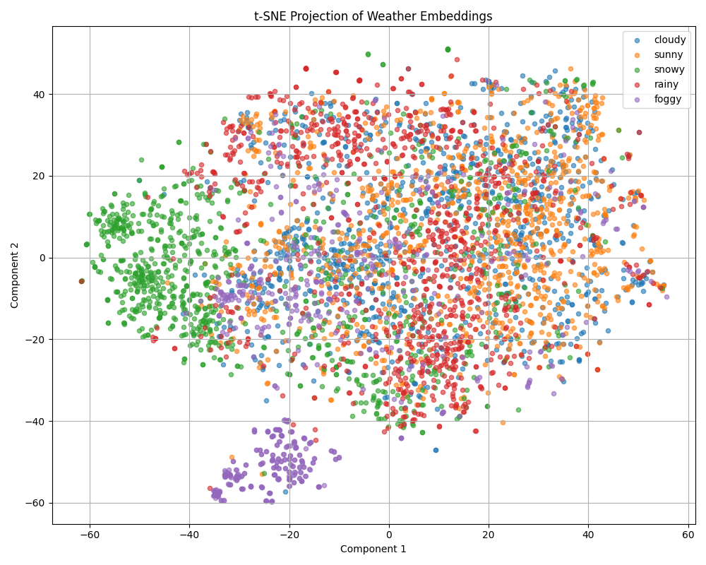

# 🌤️ Weather Image Classification with feature extraction using Im2Vec

## Objective

This project aims to explore a fast and efficient method for image classification by extracting feature vectors from images using the `Im2Vec` method and training a simple classifier (Random Forest, XGBoost, etc.) for weather condition recognition.

We apply this pipeline to a labeled weather image dataset, containing five categories: **cloudy**, **foggy**, **rainy**, **sunny**, and **snowy**.

Dataset used in this project is available on IEEE DataPort website.
You can download the dataset from https://ieee-dataport.org/documents/five-class-weather-image-dataset-1

---

## Concept

Instead of training a full CNN from scratch, we leverage a pretrained model (`ResNet18` by default) using the [img2vec-pytorch](https://pypi.org/project/img2vec-pytorch/) library to extract high-level feature vectors from images.

These vectors are then used to train a traditional machine learning classifier using `scikit-learn` or `XGBoost`.

This approach is:

- **Fast to implement**
- **Resource-efficient**
- **Highly reusable** in future computer vision projects where feature extraction is needed
          
---

## Main Steps

1. **Prepare the Dataset**  
   Organize the dataset using `ImageFolder` format:  
   `data/cloudy/`, `data/foggy/`, etc.

2. **Feature Extraction with Im2Vec**  
   Use a pretrained `ResNet18` model to extract a 512-dimensional vector per image.

3. **Train a Classifier**  
   Use `sklearn` or `xgboost` to train a simple classifier on the vectors.

4. **Evaluate Performance**  
   - Accuracy
   - Confusion Matrix

5. **Feature Visualization**  
   Reduce embeddings to 2D with PCA and t-SNE to visualize image clusters.

---

## Goals

- Learn how to apply Im2Vec in practice
- Build a robust image classification baseline
- Understand the reusability of pretrained feature extractors in Computer Vision
- Lay the foundation for future CV projects (clustering, retrieval, etc.)

---

## Results

After extracting image embeddings with Im2Vec (ResNet18) and training a Random Forest classifier, we obtained the following performance on the weather classification task:

| Class   | Precision | Recall | F1-score |
|---------|-----------|--------|----------|
| Cloudy  | 0.48      | 0.47   | 0.48     |
| Foggy   | 0.90      | 0.58   | 0.70     |
| Rainy   | 0.68      | 0.79   | 0.73     |
| Snowy   | 0.82      | 0.83   | 0.83     |
| Sunny   | 0.60      | 0.65   | 0.62     |

- **Overall Accuracy**: `67%`
- **Macro F1-score**: `0.67`

These results show that **"snowy"** and **"rainy"** classes are well detected, while **"cloudy"** is the most difficult class to predict, likely due to its visual overlap with "sunny" and "foggy". Confusion matrix can be found in the folder model/.

To better understand how the Im2Vec embeddings behave, we projected them using **t-SNE** to 2D space. The visualization reveals:

- Clear separation for **"snowy"** and **"foggy"** classes, forming compact clusters.
- Significant overlap between **"cloudy"**, **"sunny"**, and **"rainy"**, which explains the model confusion.



This analysis confirms that while Im2Vec features can separate some visual concepts well, others require **more discriminative embeddings** or **a supervised CNN fine-tuning** to improve classification.

---

## 🛠️ How to Use

Install requirements:
```bash
pip install -r requirements.txt
```
extract features and train your model:
```bash
python extract_features.py
python train_classifier.py
```

## Credits

Based on the idea of **Im2Vec**:

- 📄 [Im2Vec Paper (Lee & Choi)](https://github.com/irenelee5645/image_vector/blob/main/Im2Vec.pdf)
- 🧰 [img2vec-pytorch on PyPI](https://pypi.org/project/img2vec-pytorch/)
